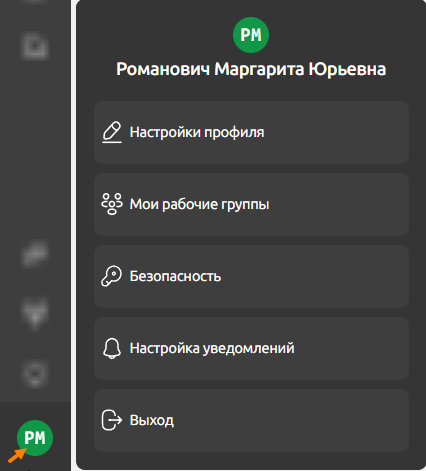
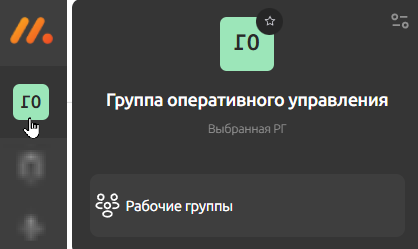
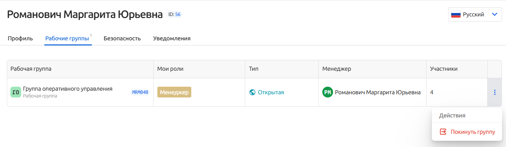

# Профиль пользователя

В **Профиле** находится основная информация об учетной записи. Здесь вы  можете сменить пароль, выпустить персональные токены доступа к API или управлять уведомлениями.

Интерфейс профиля состоит из вкладок, каждая из которых соответствует пункту меню:

Также в интерфейсе профиля в правом верхнем углу расположено меню управления локализацией интерфейса, в котором вы сможете выбрать русский или английский язык.

## Настройки профиля

<!-- проверить соответствие параметров при просмотре профиля и его редактировании. При просмотре есть параметр Telegram c плейсхолдером Chat ID. Если нажать на кнопку Редактировать аккаунт в параметре с таким же названием Telegram уже ник телеграм. Часовой пояс   становится переименован во Временную зону -->

Во вкладке вы можете:
* просмотреть *Email*, с которым связан профиль,
* изменить *Часовой пояс*,
* указать или откорректировать *Телефон*, *Организацию*, *Должность* и *Telegram*.

Внесенные изменения необходимо подтвердить нажатием на кнопку **Сохранить изменения**. При нажатии кнопки **Отмена** изменения будут сброшены.

### Редактирование профиля
После нажатия на кнопку **Редактировать аккаунт** вы будете перенаправлены в интерфейс внесения изменений.

Для корректировки будут доступны следующие данные:
* *Имя*,
* *Аватар*. Файл должен быть в одном из форматов: *.JPEG, *.PNG, *.BMP или *.WEBP, и не превышать 5 МБ,
* *Телефон*,
* *Telegram* - имя пользователя в социальной сети,
* *Временная зона*,
* *Должность*.

#### Сброс пароля
Также вам будет доступна смена пароля нажатием на кнопку **Сбросить пароль**. Если вы инициируете сброс, на ваш email будут отправлено письмо с уведомлением о подтверждении операции.
 Найти его можно по теме *"Восстановление пароля"* или отправителю *no-reply@monq.ru*.
>Если найти письмо не получается, не забудьте проверить папку **Спам**. Повторно отправить письмо с подтверждением можно, нажав на ссылку *Отправить повторно* на странице редактирования профиля.

Чтобы продолжить смену пароля, нажмите в письме на кнопку **Восстановить** или на предложенную альтернативную ссылку.

В форме восстановления введите новый пароль, удовлетворяющий требованиям надежности: не менее 6 символов, включающий хотя бы одну цифру, хотя бы один символ «!@#$&’ “()_=+-[]{}:;/|,.», а также латинские буквы в нижнем и верхнем регистре. Пример надежного пароля: P@ssw0rd!.

>⚠️ Важно! Не забудьте сохранить в надежном месте или запомнить новый пароль.

Завершите процедуру нажатием на кнопку **Сохранить и войти**. После этого вы будете автоматически авторизованы в системе с новым паролем.

Если вы передумали менять данные для авторизации, нажмите на ссылку **Я помню пароль**. 

#### Управление активными сессиями

В блоке **Активные сессии** содержится перечень всех ваших активных сессий.

Текущая сессия отмечена соответствующей меткой.

> Сессия — временный период взаимодействия пользователя с системой, в рамках которого система может «помнить» определённую информацию о пользователе.

Когда может понадобиться завершение сессии? Обычно сессия завершается в целях обеспечения безопасности ваших данных. Например, если устройством, на котором вы обычно работали, теперь пользуется другой человек. В таких случаях в целях защиты от случайной и преднамеренной порчи или утечки информации, рекомендуем вам всегда завершать ваши сессии на таких устройствах.

Для завершения сессии нажмите на кнопку   .

Если вам потребуется завершить сразу все сессии, нажмите на одноименную кнопку **Завершить все сессии**.

## Мои рабочие группы

### Что такое "рабочие группы"?
Вы можете состоять в нескольких рабочих группах.

Ваше взаимодействие с объектами системы выполняется в контексте выбранной рабочей группы, то есть вы "видите" только те объекты, которые принадлежат выбранной рабочей группе, в контексте которой вы сейчас находитесь.

Так, чтобы взаимодействовать с объектами других рабочих групп, вам нужно в качестве текущего контекста выбрать ту рабочую группу, которой принадлежит объект.

Выбор рабочей группы осуществляется через основное меню системы:

### Просмотр перечня рабочих групп

Во вкладке *Мои рабочие группы* собран перечень групп, в которых вы состоите:

По каждой группе представлена следующий информация:
* *Рабочая группа* - название группы,
* *Мои роли* - роль, присвоенная вам в рамках группы,
* *Тип*: *Приватная*, *Открытая* или *Закрытая*,
* *Менеджер* - данные пользователя с ролью менеджера группы,
* *Участники* - количество членов группы,

При нажатии на строку, вы сможете перейти на страницу *Список рабочих групп* к параметрам выбранной группы. 

Подробно ознакомится с функционалом рабочих групп можно в документации [Рабочие группы](/docs/platform_settings/work_groups/index).

### Выход из рабочей группы

Выйти из состава рабочей группы можно, выбрав в контекстном меню строки соответствующей группы действие **Покинуть группу**.

>⚠️ Важно! При выходе из группы вы можете потерять доступ к некоторым объектам системы. Поэтому перед выполнением этой операции рекомендуем тщательно проверить, останется ли у вас доступ к критически важной инфраструктуре системы.

## Безопасность
### Редактирование аккаунта
Во вкладке вы сможете изменить пароль, нажав на кнопку **Редактировать аккаунт**. В остальном процедура аналогична описанной в разделе [Сброс пароля](сброс-пароля).

### Токены для API

Во вкладке *Безопасность* вы можете сгенерировать личный токен авторизации для работы с API.

<!-- добавить ссылку на страницу с описанием АПИ -->

Действия по выпуску токена:

1. Введите описание токена в соответствующее поле (опционально),

2. Выберите область действия токена:

* *Read* – токен будет работать только для запросов на получение данных,
* *Write* – токен будет работать для запросов на редактирование данных,
3. Выберите срок действия токена. Если вы активируйте опцию *Бессрочный* – токен будет действовать до тех пор, пока не будет отозван вручную. При деактивированной опции потребуется указать *Дата окончания действия*, после наступления которой токен будет автоматически отозван.
4. Подтвердите оформление токена – нажмите «Выпустить токен»

> ⚠️ Важно! В целях безопасности выдаваемый токен шифруется и однократно выводится в правом верхнем углу экрана. Параллельно с этим токен автоматически копируется в буфер обмена. Рекомендуем сохранить токен сразу после его создания, так как получить его значение повторно не получится.

#### Статусы токенов

После выпуска токена до момента его деактивации нажатием на кнопку **Отозвать** или пока его срок действия не истек, он имеет статус *Активный*. 

Соответственно, если срок действия токена истек или вы решили принудительно его заблокировать, он получит статус *Отозван*.

> ⚠️ Важно! Отмена отзыва токена не доступна, после блокировки вы не сможете его использовать.

Все выпущенные вами токены, как  *Активные*, так и *Отозванные*, расположены в блоке **Активные токены**.

#### Действия с активными токенами

Активные токены доступны для редактирования после нажатия на кнопку *Изменить*. 
Для корректировки доступно описание и срок действия токена.

#### Действия с отозванными токенами

>**Почему мы храним отозванные токены?** Они позволяют структурировано хранить и отображать информацию о дате окончания его действия, что особенно полезно при автоматическом отзыве токена.

Не активные токены не доступны для редактирования и при необходимости их можно удалить – для этого просто нажмите на значок Корзины.

## Настройки уведомлений

Во вкладке *Уведомления* собраны настройки, позволяющие персонализировать способ получения уведомлений в зависимости от приоритета событий.

Возможности по настройке уведомлений:

**Включение/выключение уведомлений** – для управления переместите переключатель в нужное положение. Если деактивировать визуальные уведомления (переключатель окрасится в серый цвет), оповещения не будут отображены в интерфейсе.

**Изменение звукового сигнала** – выполняется выбором типа оповещения из предложенного списка для каждого уровня приоритета. Такой подход позволит вам отключать звуковые оповещения, сохраняя при этом визуальные. Для вашего удобства вы можете сразу прослушать выбранную мелодию и выбрать оптимальный для себя вариант.

Вы в любой момент можете вернуться к системным настройкам, нажав на кнопку **Сбросить**.

После внесения изменений не забудьте нажать **Сохранить изменения**.

> ⚠️ Важно! Изменения уведомлений сохраняются только для текущего пользователя и не затрагивают настройки для других учетных записей.

## Выход

Завершение сессии выполняется через главное меню - **Профиль - Выход**.

## Связанные разделы

<a href="../platform_settings/work_groups/index.md" style="display: block; padding: 1.2rem; background-color: #fdfdfe; border: 1px solid #d4d5d8; border-radius: 8px; text-decoration: none; color: #474748; margin: 1rem 0;">
    <strong>📚 Рабочие группы </strong>
     
    в этом руководстве вы найдете подробное описание рабочих групп: зачем они нужны, какие бывают и т.п.
</a>

<a href="./pricing_plans/index.md" style="display: block; padding: 1.2rem; background-color: #fdfdfe; border: 1px solid #d4d5d8; border-radius: 8px; text-decoration: none; color: #474748; margin: 1rem 0;">
    <strong>📚 Лицензии </strong>
     
    в этом разделе вы сможете подобрать для себя оптимальный тарифный план.
</a>

<a href="./basic_information/quick_start/index.md" style="display: block; padding: 1.2rem; background-color: #fdfdfe; border: 1px solid #d4d5d8; border-radius: 8px; text-decoration: none; color: #474748; margin: 1rem 0;">
    <strong>📚 Быстрый старт </strong>
     
    здесь вы сможете попрактиковаться и с легкостью создать свой первый несложный рабочий процесс.
</a>
 
